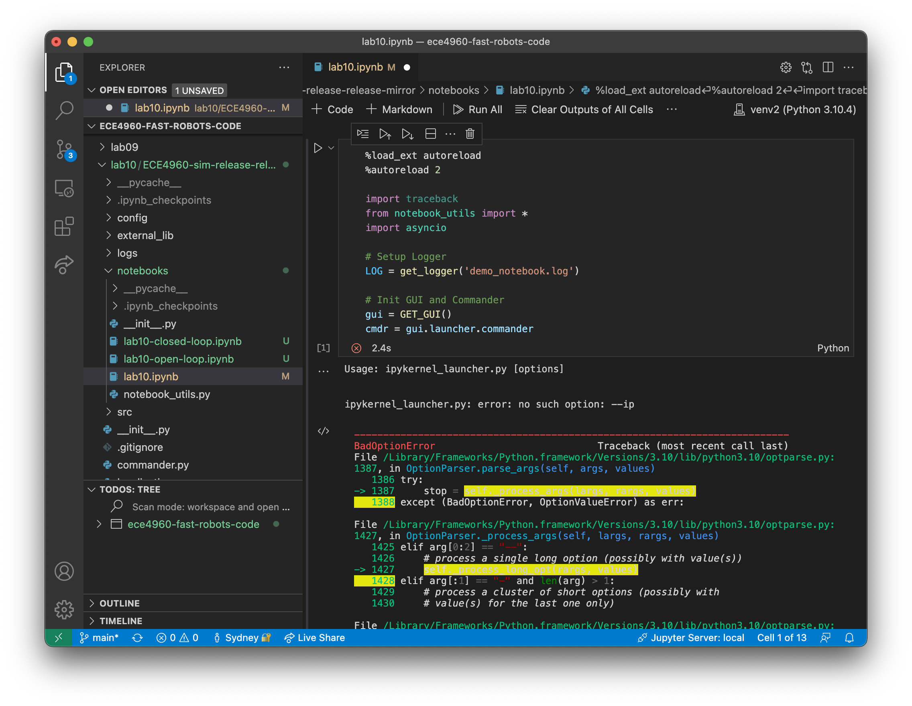
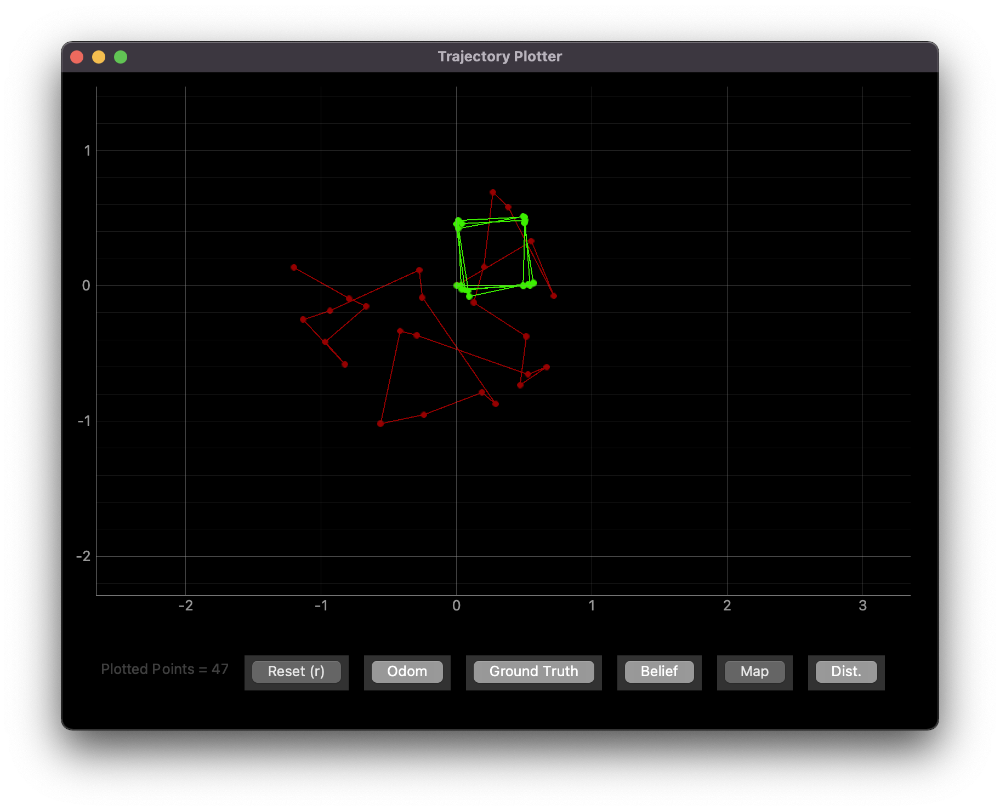
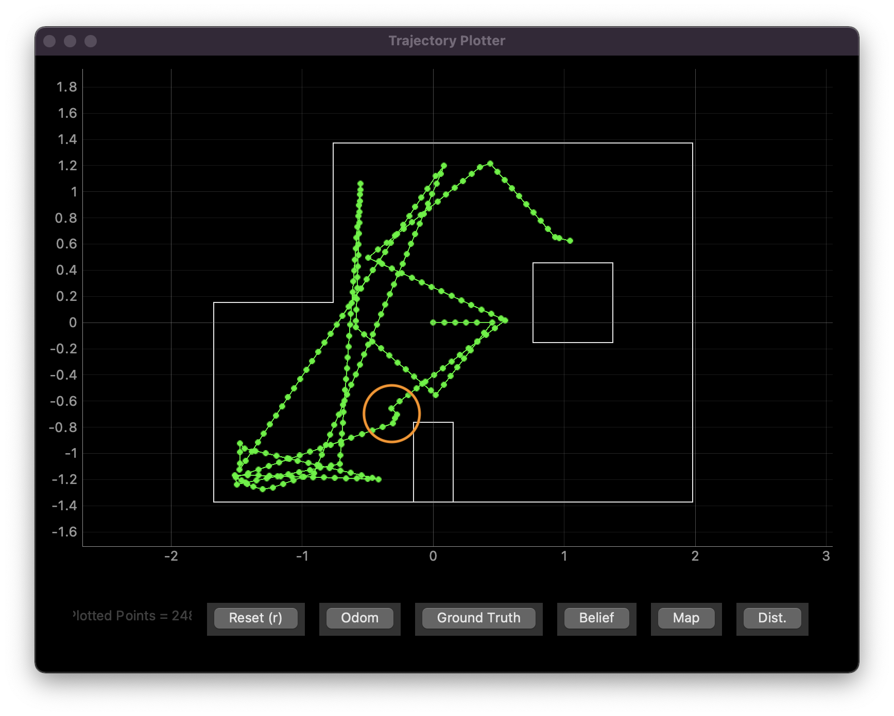

# Lab 10: Simulator

[Click here to return to home page](https://slawrence100.github.io/ece4960-fast-robots/)

## Objective
Become familar with the robot simulator to do some basic tasks (and more advanced ones later)

## Setup / Installation

I'm running macOS Monterey on an intel-based Mac and nearly everything worked smoothly. The only strange issue I had with the simulator was that running the Jupyter notebooks in Visual Studio Code like I usually do no longer works:



Although I wasn't able to use VSCode like I usually do, I simply started the notebook with the `jupyter notebook` command in the new, activated virtual environment to complete the lab.

As instructed, all of my lab notebooks are in the `notebooks/` directory. You can find all of my lab code on my [Github repo](https://github.com/slawrence100/ece4960-fast-robots-code/tree/main/lab10/ECE4960-sim-release-release-mirror/notebooks). The notebooks are the only thing that had to be modified for this lab.

## Task 1: Simulator Description
The simulator includes a GUI to help visualize a robot moving on a map like the one in class and plot where the robot is based on different data sources.

It has some arrow-key controls that alter the linear and angular velocities of the robot by a small step size. I used them to test out how the robot moves:

[](http://www.youtube.com/watch?v=71-kz9fVbRs)

I did the same thing with the plotter open in order to see how the plots looked:

[](http://www.youtube.com/watch?v=y_CP5qXYGXw)

The plotter has features to plot both the ground-truth position (green) and the odometry-based position (red). It looks like the odometry is realistic, as my work on robots in previous classes tell me that odometry will be very uncertain. 

There is also a button to plot the map, and a few other buttons to plot other useful info, but I moved on to using the simulator programatically at that point.

## Task 2: Open-Loop Control
To demonstrate open-loop control, I had my robot simply drive in a square by using time-based commands. The robot would drive for 1 second at 0.5 m/s, then rotate for 1 second at 90 degrees per second, and finally repeat these steps indefinitely to expose any drifting that might happen if the robot doesn't rotate to exactly 90 degrees.

```python
while cmdr.sim_is_running() and cmdr.plotter_is_running():
  for _ in range(4):
    plot_current_gt()
    cmdr.set_vel(0.5, 0)
    await asyncio.sleep(1)
    plot_current_gt()
    cmdr.set_vel(0, np.pi/2)
    await asyncio.sleep(1)
  cmdr.set_vel(0,0)
```

[](http://www.youtube.com/watch?v=GCAgukquoig)



From the plot, the ground truth (green) suggests that the robot doesn't rotate in exact 90-degree increments. This is likely due to how my code is time-based; if the velocity change is not instantaneous, the robot might rotate less than 90 degrees, and if `asyncio.sleep()` blocks for longer than 1 second due to how my computer's OS prioritizes processes are prioritized, the robot might rotate more than 90 degrees. This causes some inconsistencies in how square the path can be.

Also, compared to the ground truth (green), the odometry (red) is wildly off. In the real world, this could be explained by ideas like wheel slippage, inconsistencies in wheel diameter, etc. The simulator likely has similar noisiness encoded into it to make the odometry match the real world.

## Task 3: Closed-Loop Control

To demonstrate closed-loop control, I used the robot's front time-of-flight sensor to determine when the robot should turn away from an obstacle. Initially, I had it turn about 90 degrees; that produced an uninteresting end result, so I had it turn randomly instead.

```python
while cmdr.sim_is_running() and cmdr.plotter_is_running():
    plot_current_gt()
    if cmdr.get_sensor()[0] < 0.3:
        cmdr.set_vel(0, random.uniform(-1 * np.pi, np.pi))
        await asyncio.sleep(1)
    else:
        cmdr.set_vel(1, 0)
```

From the code above, the robot tries to avoid obstacles as long as they're closer than 30 cm away. Although this seems large, I noticed that when I crashed the robot into a wall head-on, the ToF sensor would still read anything from 9 to 19 cm. The extra 10 cm was designed for padding; if the robot is positioned close enough, it may see a wall much farther than an obstacle it can hit and crash:



[](http://www.youtube.com/watch?v=RmapOsE9zS8)


Although this shows a linear velocity of 1 m/s, I've been able to get to 5 m/s with some degree of success. However, the robot has difficulty with corners at any speed; this is because the time-of-flight sensor doesn't account for the width of the robot.

To minimize crashes, there are a few things I can do:
- **Only turn 180 degrees when an obstacle is found**. Given the map, this would cause the robot to move back and forth along a relatively slim line. Although this avoids crashes, it doesn't let you explore the map.
- **Make the buffer larger**. I chose a 30 cm buffer, but I definitely could have chosen a larger one to turn earlier. However, there's always a chance the sensor line of sight is very close to a corner in the wall, causing the robot to crash because it collides with the corner. A buffer that's too large may also cause the robot to spin in circles, which also limits map exploration.

