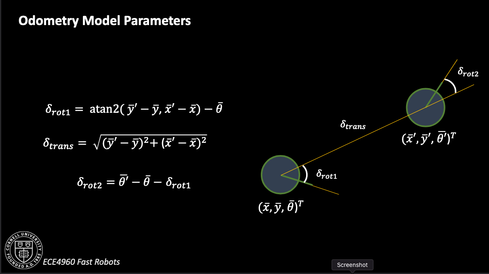
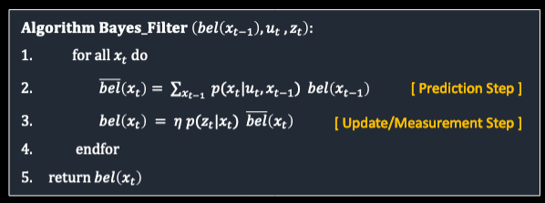

# Lab 11: Bayes Filter (in simulation)

[Click here to return to home page](https://slawrence100.github.io/ece4960-fast-robots/)

## Objective
Use the robot simulator to implement a Bayes filter for localization.

## Background
The write-up does a good job describing the environment and the model of the world, but I wanted to add some of the key details here:

- The robot's state is discretized into a 12x9x18 grid, representing 12 x-coordinates, 9 y-coordinates, and 18 orientation angles.
- Both the sensor and control noise are modeled by a gaussian distribution.
- The sensor measurements are given in batches of 18 readings from a distance sensor taken at equal angular intervals from a given starting orientation. This is probabilistically modeled using the beam model of range finders.
- Each control action consists of one rotation, followed by one translation, followed by one additional rotation.

## Implementation Details

My full implementation can be found on [my GitHub repo](https://github.com/slawrence100/ece4960-fast-robots-code/blob/main/lab10/ECE4960-sim-release-release-mirror/notebooks/lab11.ipynb).

### Setup for the Bayes Algorithm
To compute control inputs from one pose to the next, I used the provided equations from lecture.



The odometry motion model itself is based on turning, moving, then turning again. All of these three actions are presumed independent, so the probability that a robot ends up on some new state from its previous state is the product of the probabilities it did each individual action correctly:

```python
rot1, trans, rot2 = compute_control(cur_pose, prev_pose) # what actually happened
    rot1_u, trans_u, rot2_u = u # what we told the bot to do
    
    rot1_prb = loc.gaussian(rot1, rot1_u, loc.odom_rot_sigma)
    trans_prb = loc.gaussian(trans, trans_u, loc.odom_trans_sigma)
    rot2_prb = loc.gaussian(rot2, rot2_u, loc.odom_rot_sigma)

    prob = rot1_prb * trans_prb * rot2_prb
```

I then needed to model the prediction and update steps in the Bayes algorithm shown here:



### The Prediction Step
To make the code easier to read, I used Numpy's `nditer()` iterator. This would allow me to track indices as well as iterate without creating three loops (and deal with how indentation can be hard to read sometimes). It also allows me to plug in an index as one item instead of three, saving some visual space as I iterate through every pair of states in the belief.

```python
def prediction_step(cur_odom, prev_odom):
    prev_it = np.nditer(loc.bel, flags=['multi_index'])
    cur_it = np.nditer(loc.bel, flags=['multi_index'])
    for prev in prev_it:
        if prev <= 0.0001:
            continue
        prb_sum = 0
        x_prev,y_prev,theta_prev = prev_it.multi_index
        prev_pose = mapper.from_map(x_prev, y_prev, theta_prev)
        for cur in cur_it:
            x_cur,y_cur,theta_cur = cur_it.multi_index
            cur_pose = mapper.from_map(x_cur, y_cur, theta_cur)
            u = compute_control(cur_pose, prev_pose)
            prb_sum += odom_motion_model(cur_odom, prev_odom, u) * loc.bel[prev_it.multi_index]
        loc.bel_bar[prev_it.multi_index] = prb_sum

    loc.bel_bar = normalize(loc.bel_bar)
```

### The Update Step
The update step iterates much like the prediction step does, but it also relies on the sensor model to make its updates.

```python
def update_step():
    obs = loc.obs_range_data # Current observations
    cur_it = np.nditer(loc.bel_bar, flags=['multi_index'])
    for cur in cur_it:
        x_cur,y_cur,theta_cur = cur_it.multi_index
        cur_pose = mapper.to_map(x_cur, y_cur, theta_cur)
        loc.bel[cur_it.multi_index] = np.prod(sensor_model(obs, cur_it.multi_index)) * loc.bel_bar[cur_it.multi_index] 
    loc.bel = normalize(loc.bel)
```

## Results

### Trial 1

Path Shape

[](http://www.youtube.com/watch?v=gw0RIcmTnuI)

Probability Distribution

[](http://www.youtube.com/watch?v=FirSJZizq0g)

### Trial 2

Path Shape

[](http://www.youtube.com/watch?v=hNPuidLtQpc )


Probability Distribution

[](http://www.youtube.com/watch?v=XxTL5RFNQXE)

Data for Trial 2 can also be found in text form in my [GitHub repo](https://github.com/slawrence100/ece4960-fast-robots-code/blob/main/lab10/ECE4960-sim-release-release-mirror/notebooks/bayes-filter-2.txt).

### Analysis

The Bayes filter is generally good at predicting which cell the robot is in. It often works well because each position the robot stops in is relatively unique; that is, the view from the sensors is different in each place it stops, so it can use the precached sensor views to figure out approximately where it is, as shown by how quickly the distribution gains confidence. 

However, if there were to be a place where the views look similar (perhaps in two corners of a very large map), the Bayes filter may struggle to localize correctly because it would have similar probabilites assigned to corresponding areas that look the same. 