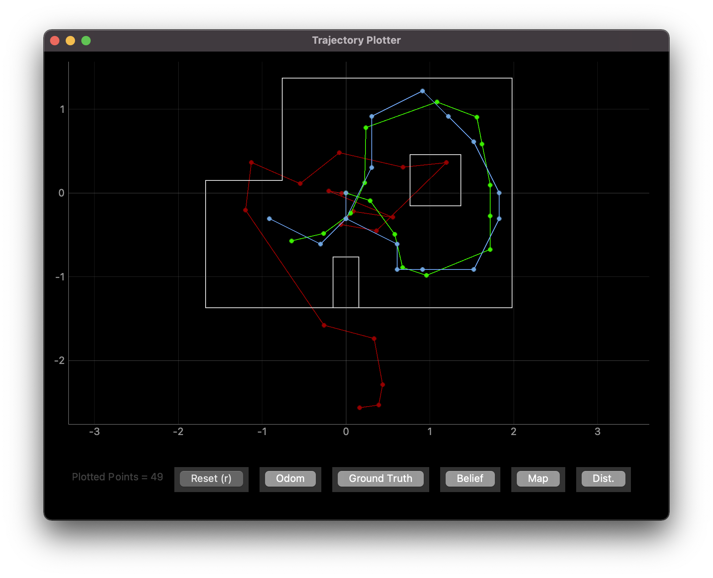
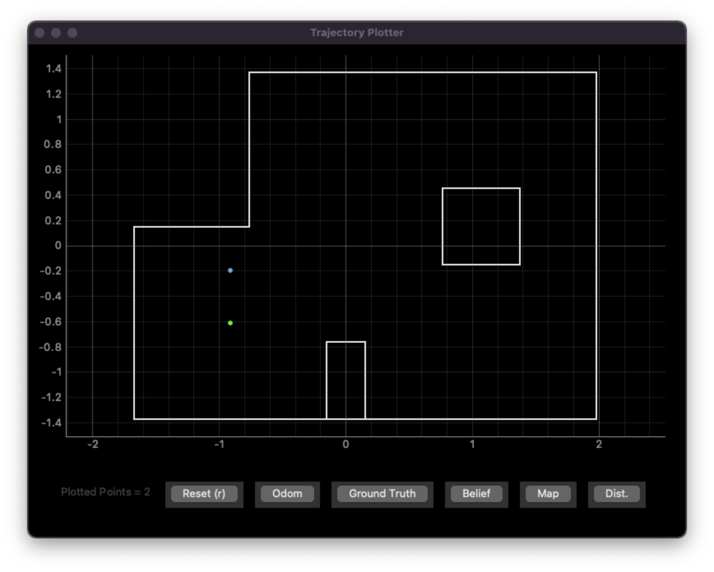
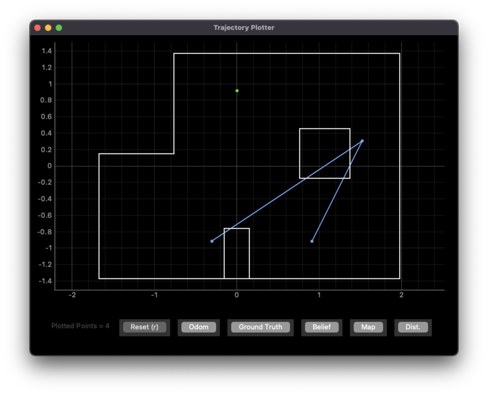

# Lab 12: Bayes Filter (with a real robot)

[Click here to return to home page](https://slawrence100.github.io/ece4960-fast-robots/)

## Objective
Apply the knowledge and Bayes filter from the the robot simulator on a real robot.

## Sanity Check: Localize in Simulation
The code is given for this exercise, so I made sure that the localization worked reasonably well by running the localization in simulation



As expected, the predicted path (blue) is reasonably close to the ground truth path (green).

## Real-World Localization

All code can be found in my [Github repository](https://github.com/slawrence100/ece4960-fast-robots-code/tree/main/lab10/ECE4960-sim-release-release-mirror/notebooks).

### Setup and Code
To get the robot to mirror the simulator, I had to write some code that would allow it to spin 20 degrees and take the average of three sensor readings (my ToF sensor is very noisy, so averaging can help with that noise)

```cpp
void handle_command() {
  ...
  case OBSERVE:
    for (int i = 0; i < 18; i++) {
      turn_degrees(-20);
      for (int j = 0; j < 3; j++) {
        tempMeasurement += get_tof_measurement(distanceSensorTwo, true);
      }
      sensor_meas[i] = tempMeasurement / 3.0;
      angle_meas[i] = pitch;
      tempMeasurement = 0;
    }
    break;
}

```

Although this is very similar to my code for [the mapping lab](https://slawrence100.github.io/ece4960-fast-robots/lab9), I made a few adjustments (mostly positive and negative signs) to compensate for what the sensor reads as a "positive" angle - my sensor reads positive angles as clockwise, which is against convention, so I reverse it in `turn_degrees(-20)` to produce a counter-clockwise spin. This version uses P-control:

```cpp
void turn_degrees(int deg) {
  pitch = 0; // zero-out IMU data
  first_imu = true;
  while (true) {
    get_imu_measurement(&myICM, true);
    int motor_power = pid_proportional * (pitch - deg);
    if (motor_power >= 200 || motor_power <= -200) { // max power
      motor_power = 200 * ((motor_power < 0) ? -1 : 1);
      spin(motor_power, -1*motor_power * motor_calib_factor);
    } else if (abs(pitch - deg) < 0.5) { // close enough to equal
      stop_motors(true);
      return;
    } else { // somewhere in between - use p-control
      motor_power = ((motor_power < 0) ? -1 : 1) * max(abs(pid_min_power), abs(motor_power));
      spin(motor_power, -1 * motor_power * motor_calib_factor);
    }
  }
}
```

Then, on the Python side, I direct the robot to make an observation loop and send the data back:

```python
self.set_params(1, 80, 50) # PID_p, PID min power, IMU frequency
self.set_motor_calib(1.4)
self.ble.send_command(CMD.OBSERVE, None)
self.ble.send_command(CMD.GET_DATA, None)
while len(self.dist_data) < 18 or len(self.angle_data) < 18:
    print("Data still sending, waiting")
    time.sleep(5)
    self.ble.send_command(CMD.GET_DATA, None) # try again for command not sent?
```


Since I also send data back in millimeters and re-zero the angle each time, I had to do some post-processing to get the data to match what `perform_observation_loop()` expects:

```python
self.dist_data = [x / 1000 for x in self.dist_data]
temp_angles = []
temp_sum = 0
for i,angle in enumerate(self.angle_data):
    temp_sum -= angle
    temp_angles.append(temp_sum)
self.angle_data = temp_angles
return np.array(self.dist_data).reshape((18,1)), np.array(self.angle_data).reshape((18,1))
```

### Results

The results vary by lab point.

### (5 ft, -3 ft, 0 degrees)


Predicted pose: (0.914 m, -1.219 m , -30.000 degrees) = (2.74 ft, -4.00 ft, -30 degrees)

Actual pose: (5 ft, 3 ft, 0 degrees)

Error: (2.26 ft, 1 ft, -30 degrees) or 2.47 ft euclidian distance

### (-3 ft, -2 ft, 0 degrees)



Predicted pose: (-0.914 m, -0.914 m, 90.000 degrees) = (-3.00 ft, -3,00 ft, 90 degrees)

Actual pose: (-3 ft, -2 ft, 0 degrees)

Error: (0 ft, 1 ft, 90 degrees) or 1 ft euclidian distance

### (5 ft, 3 ft, 0 degrees)


Predicted pose: (1.524 m, 0.305 m, 110.000 degrees) = (5 ft, 1 ft, 110 degrees)

Actual pose: (5 ft, 3 ft, 0 degrees)

Error: (0 ft, 2 ft, 110 degrees) or 2 ft euclidian distance

### (0 ft, 3 ft, 0 degrees)



Predicted poses: 
- (-1.00 ft, -3.00 ft, -170 degrees)
- (5.00 ft, 1.00 ft, 110 degrees) 
- (3.00 ft, -3.00 ft, 150 degrees)

## Analysis

- With the exception of trying to localize (0 ft, 3 ft), the robot knows where it is with an error of about 2 feet. This is likely due to the unpredictability of how consistently the robot can turn 20 degrees on its axis and the noise of the distance sensor. Similarly, this is likely the cause of why the robot generally has large errors in its orientation.
- The robot can localize somewhat well in any point that isn't (0 ft, 3 ft) because the view from each of those points is distinct. To see why this is the case, consider a perfect set of measurements; even with perfection, a robot cannot distinguish two identical corners of a very large room, so it will always have trouble localizing non-unique viewpoints. 
  - This also explains why (0 ft, 3 ft) is hard to localize well; the view from there looks similar to the other points on the map (and the closeness to the wall for some places may be explained by sensor noise or the robot drifting closer to the top wall when spinning)


