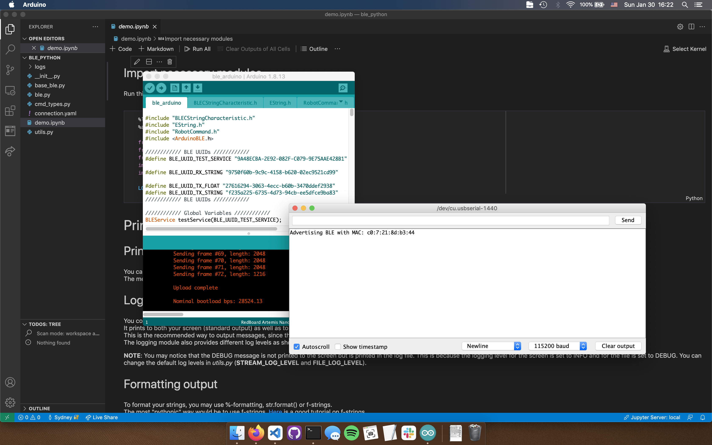
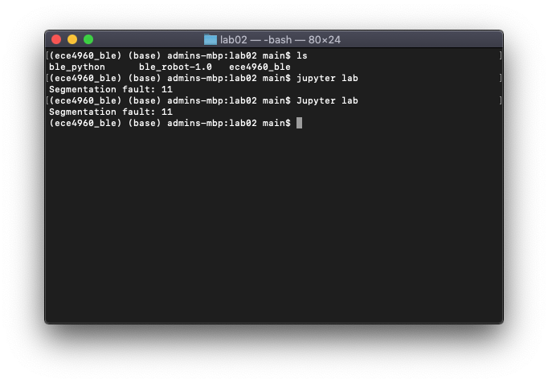
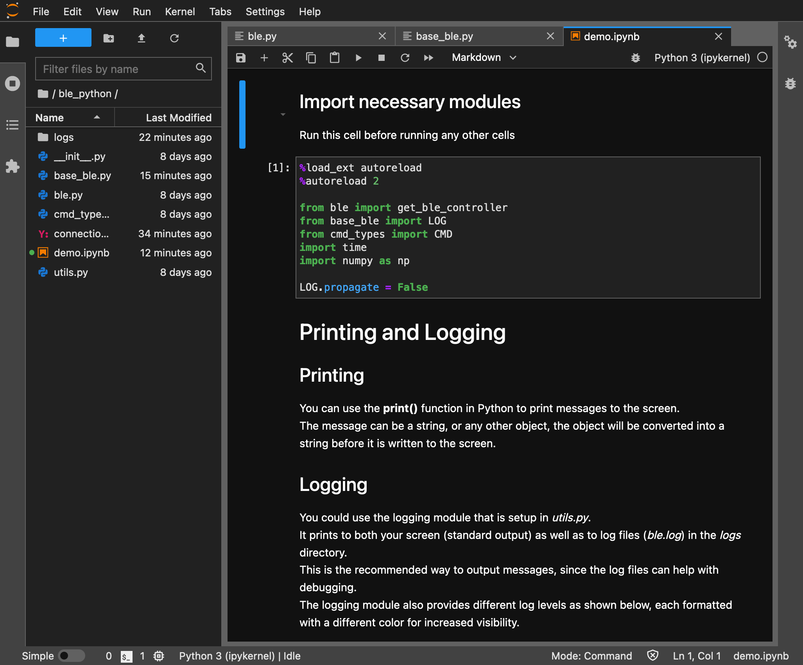
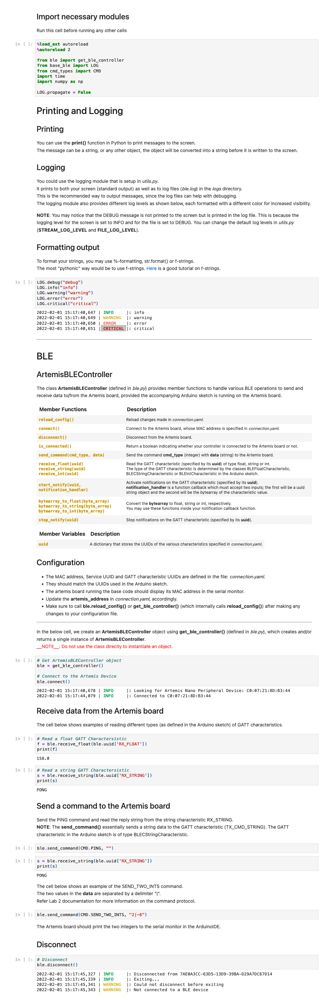
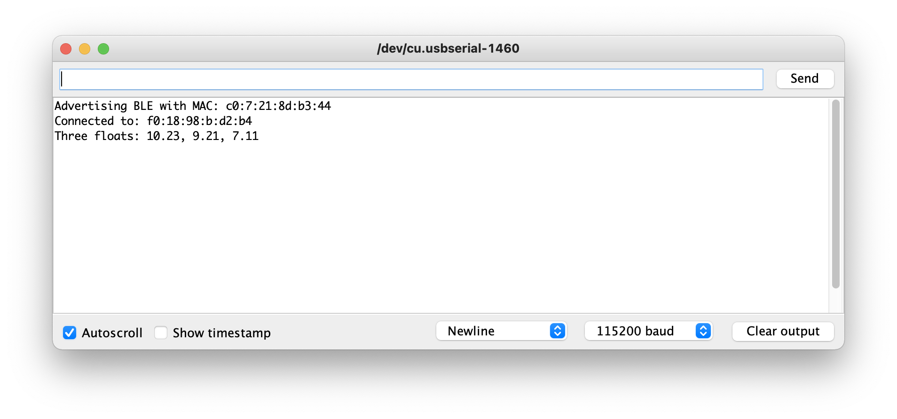

# Lab 2: Bluetooth Communication

Key code snippets are on this site, but the complete files can be found on on [GitHub](https://github.com/slawrence100/ece4960-fast-robots-code/tree/main/lab02).

## Installation

Before, I was running macOS Mojave 10.14, and the Artemis gave me its MAC address after uploading the sketch provided.


*Artemis board, tell me your secrets*

I then ran into an issue where running `jupyter lab` causes a segfault:


*Throwback to learning C in CS 3410*

After making a discussion post, I was told that my OS version was too old. Although I thought upgrading my OS would create issues with other projects, I looked into them and realized there wouldn't be any issues if I made the upgrade. So I backed up my computer, waited a few hours for the upgrade to take place, and ran everything as normal.


*Hooray, it works!*

The notebook still didn't run when I tried (as my mac failed to connect to my Artemis board). I went to lab hours for help, and TA Vivek helped me debug the issue. We discovered that [there's a known bug where the code the lab comes with has a line that will report an incorrect macOS version](https://stackoverflow.com/questions/65290242/pythons-platform-mac-ver-reports-incorrect-macos-version), so Vivek edited my code to override that line. After that, the entire notebook ran as normal. He also told me that I could use Visual Studio Code (my favorite text editor) to do this instead of a browser if I liked, so I used that to my advantage to help show that the entire demo ran smoothly.


*At long last, everything works normally now*

---

# Lab Tasks

These are all readable from this site, but I think [the GitHub preview](https://github.com/slawrence100/ece4960-fast-robots-code/blob/main/lab02/ble_python/lab02_tasks.ipynb) is prettier.

## Setup
This code is ripped straight from the demo. It imports requirements and connects the board to the computer.


```python
%load_ext autoreload
%autoreload 2

from ble import get_ble_controller
from base_ble import LOG
from cmd_types import CMD
import time
import numpy as np

LOG.propagate = False

# Get ArtemisBLEController object
ble = get_ble_controller()

# Connect to the Artemis Device
ble.connect()
```

    2022-02-01 16:50:19,827 | INFO     |: Looking for Artemis Nano Peripheral Device: C0:07:21:8D:B3:44
    2022-02-01 16:50:23,755 | INFO     |: Connected to C0:07:21:8D:B3:44


## Task 1
*Send an ECHO command with a string value from the computer to the Artemis board, and receive an augmented string on the computer.*

### Arduino Code Changes
```cpp
/*
* Add a prefix and postfix to the string value extracted from the command string
*/
case ECHO:

  char char_arr[MAX_MSG_SIZE];

  // Extract the next value from the command string as a character array
  success = robot_cmd.get_next_value(char_arr);
  if (!success)
      return;

  /*
  * Your code goes here.
  */
  tx_estring_value.clear();
  tx_estring_value.append("Robot says: \"");
  tx_estring_value.append(char_arr);
  tx_estring_value.append("\"");
  tx_characteristic_string.writeValue(tx_estring_value.c_str());

  Serial.print("Sent back: ");
  Serial.println(tx_estring_value.c_str());

  break;
```

### Python Command and Test


```python
ble.send_command(CMD.ECHO, "Greetings, human")
msg = ble.receive_string(ble.uuid['RX_STRING'])
print(msg)
```

    Robot says: "Greetings, human"


## Task 2
*Send three floats to the Artemis board using the SEND_THREE_FLOATS command and extract the three float values in the Arduino sketch.*

### Arduino Code Changes
```cpp
/*
* Extract three floats from the command string
*/
case SEND_THREE_FLOATS:
  /*
  * Your code goes here.
  */
  float float_1, float_2, float_3;
  // Extract 3 floats in sequence, and fail if any one of them fails
  success = robot_cmd.get_next_value(float_1);
  if (!float_1) return;
  success = robot_cmd.get_next_value(float_2);
  if (!float_2) return;
  success = robot_cmd.get_next_value(float_3);
  if (!float_3) return;

  Serial.print("Three floats: ");
  Serial.print(float_1);
  Serial.print(", ");
  Serial.print(float_2);
  Serial.print(", ");
  Serial.println(float_3);
  
  break;
```

### Python Command and Test


```python
ble.send_command(CMD.SEND_THREE_FLOATS, "10.23|9.21|7.11")
```



## Task 3
*Setup a notification handler in Python to receive the float value (the **BLEFloatCharactersitic** in Arduino) from the Artemis board. In the callback function, store the float value into a (global) variable such that it is updated every time the characteristic value changes. This way we do not have to explicitly use the `receive_float()` function to get the float value.*

### Python Code Changes
*Arduino code not modified*


```python
current_float_recv = 0.0

# Record received float notifications 
def handle_recv_float(uuid, val):
  global current_float_recv
  print(ble.bytearray_to_float(val))

ble.start_notify(ble.uuid['RX_FLOAT'], handle_recv_float)

# Wait for three seconds before stopping notifications
# to avoid flooding the notebook output
time.sleep(3)
ble.stop_notify(ble.uuid['RX_FLOAT'])
```

    2850.5
    2851.0
    2851.5
    2852.0
    2852.5
    2853.0


## Task 4
*In your report, briefly explain the difference between the two approaches:*

  1. *Receive a float value in Python using `receive_float()` on a characteristic that is defined as `BLEFloatCharactersitic` in the Arduino side*
  2. *Receive a float value in Python using `receive_string()` (and subsequently converting it to a float type in Python) on a characteristic that is defined as a `BLECStringCharactersitic` in the Arduino side*


Approach 1 receives the float by directly interpreting the byte array the Arduino sends as a floating-point value, likely according to IEEE 754.

Approach 2 receives the "float" by receiving a string and interpreting that as a float by a character-wise conversion, which restricts one to sending numbers with a number of characters less or equal to the longest possible string one can send.

The main practical difference here is that using `receive_float()` in Approach 1 will allow one to express a far larger range of numbers than using `receive_string()` and converting afterwards given the same amount of data sent over Bluetooth. 

Here's why:
- Assuming the Artemis is using a 32-bit single-precision floating point number, [one can express numbers from ±10^-38 to about ±3*10^38 to 7 decimal places](https://en.wikipedia.org/wiki/Single-precision_floating-point_format)
- Each character of a string takes 8 bits, so we have at most 4 characters to work with. Assuming the string represents a human-readable number,
  - The maximum number we can represent is `"9999"`
  - The minimum number we can represent is `"-999"`
  - The smallest increment we can represent is `".001"`

Based on these assumptions, it's better to use Approach 1.