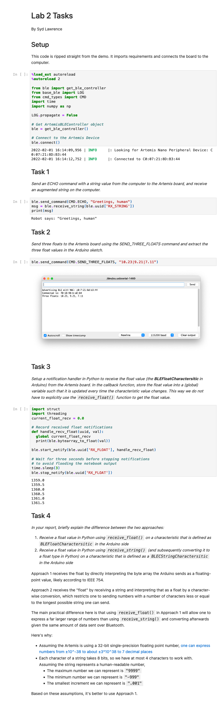

## Lab 2: Bluetooth Communication

### Installation

Before, I was running macOS Mojave 10.14, and the Artemis gave me its MAC address after uploading the sketch provided.

*Artemis board, tell me your secrets*

I then ran into an issue where running `jupyter lab` causes a segfault:

*Throwback to learning C in CS 3410*

After making a discussion post, I was told that my OS version was too old. Although I thought upgrading my OS would create issues with other projects, I looked into them and realized there wouldn't be any issues if I made the upgrade. So I backed up my computer, waited a few hours for the upgrade to take place, and ran everything as normal.

*Hooray, it works!*

The notebook still didn't run when I tried (as my mac failed to connect to my Artemis board). I went to lab hours for help, and TA Vivek helped me debug the issue. We discovered that [there's a known bug where the code the lab comes with has a line that will report an incorrect macOS version](https://stackoverflow.com/questions/65290242/pythons-platform-mac-ver-reports-incorrect-macos-version), so Vivek edited my code to override that line. After that, the entire notebook ran as normal. He also told me that I could use Visual Studio Code (my favorite text editor) to do this instead of a browser if I liked, so I used that to my advantage to help show that the entire demo ran smoothly.

*At long last, everything works normally now*

## Tasks
