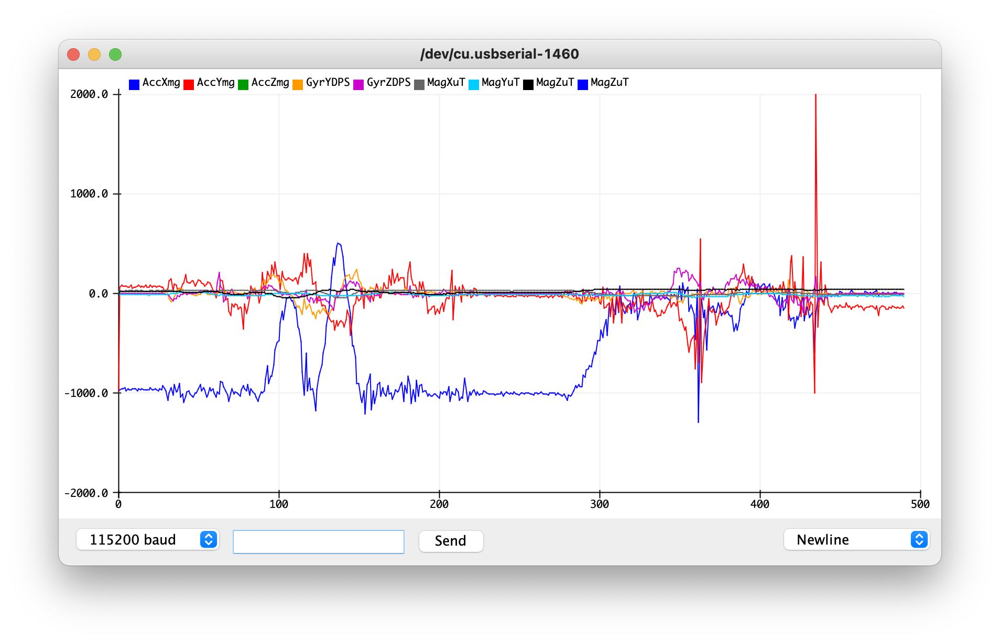
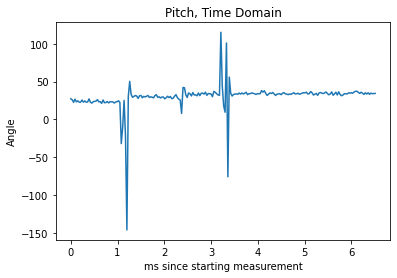
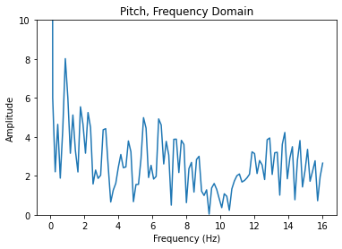
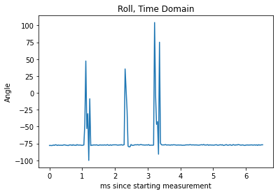
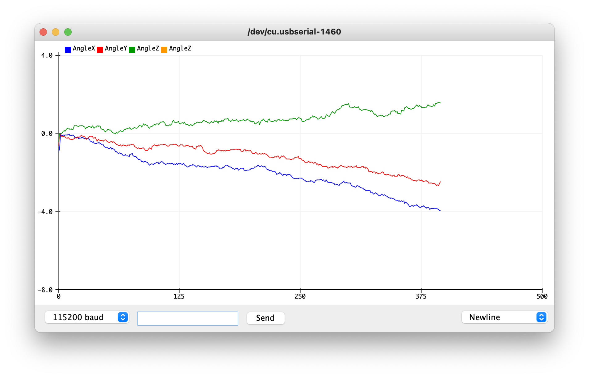

# Lab 3: Sensors

## Prelab

The lab involved some things I wrote about before I came in:

**Both Time-of-Flight Sensors have the same I2C address.** In order to allow the Artemis to connect to both sensors, I considered two main options:
- Change one sensor's address on every startup
  - Pros: Takes a little longer to start up (code may be more complicated), gets data from two sensors at once (or very close in sequence)
  - Cons: Uses more power to have 2 sensors on at once
- Use one sensor at a time
  - Pros: May save power by only having one sensor on at a time, code to switch sensors is simple (i.e. write 1 or 0 to each shutdown pin)
  - Cons: May be slow if boot time is slow (takes up to 1.2 ms, so that's probably acceptable)

I chose to change one sensor's address upon startup. This will allow me to have both sensors on and communicaiting data in high-speed situations, which may become useful in future labs.


**The Time-of-Flight Sensors have a finite range.** This means that considering where to place them is important for future labs. The datasheets say their range is between 75 and 135 cm in a "strong ambient light", and their angular range is between 15 and 27 degrees.

Since I know that the car is designed to flip over, I plan to place one sensor in the middle of the car's front bumper and one sensor in the middle of the car's rear bumper. This should allow me to detect any object directly in front or behind the car, but will miss any small obstacles that are too close to the wheels (i.e. a corner of a wall near the wheels) or anything to the side of the robot (i.e. a "T-bone" collision). 
- I assume the place the robot will run is fairly "static", meaning that there are no obstacles that should move and crash into my robot (which makes the T-bone scenario unlikely)
- I assume that the robot should start "far enough" that obstacles are wide enough to be detectable by the sensors.

The sensors themselves may have some sensitivities to color and texture, which we'll test later.

## Electrical Connections


I daisy-chained my sensors together in this order. Since I want the ToFs to be far away from each other, I'm expecting to put the Artemis closer to the IMU; I then chose to use long, braided wires for each sensor to allow for flexibility in sensor placement later.

I am also accustomed to using breadboards for most of my electronics work, but that is not recommended in this class because of parasitic capacitance and other forms of electromagnetic interference. I chose to solder wires onto the sides the sensors were in order to have a flat surface to mount them onto the car later. Although detachable connections would be helpful in case a sensor became damaged, adding header pins would interfere with the placement of the sensors themselves; thus, I decided to solder everything instead.


## Time of Flight Sensors

After wiring and soldering everything, I ran a scan of the I2C bus:


Although this looks like there's a detected sensor on every address, this is because I never shut down either ToF sensor on startup. This is also a known issue posted on [EdStem post #66](https://edstem.org/us/courses/17938/discussion/1135044) that can still work, so I went ahead with getting sensor data anyway.

### TOF Ranging Mode
The time of flight sensor has three modes for ranging, each with their own trade-offs:
- Short distance mode (up to 1.3 meters)
  - Pros: Best for when ambient light may interfere with the sensor reading
  - Cons: Short distances only
- Medium distance mode (up to 3 meters)
  - Nothing is directly said in the manual here, but it is probably a balanced mode that's OK at dealing with ambient light at a moderate range
- Long distance mode (up to 4 meters)
  - Pros: Best for when high ranges are required
  - Cons: Not as good at blocking ambient light interference

Given the size of the lab, I predict that we will only need the short distance mode. However, if I find out the lab changes, it seems like the best strategy is to use the shortest range mode that works in order to allow the sensor to best compensate for strong ambient lighting.

### TOF Range Test
For all of these tests, I mounted one ToF sensor to my laptop's screen using a ukelele capo (shout-out to Linda, a fellow student, for lending that to me!)


I first tested the time of flight sensor using the short distance mode on a white piece of paper.


(all measurements in millimeters)

The sensor readings seem to be both accurate and precise - although some show a constant drift, that may be a product of difficulties in getting a perfect right angle between the sensor beam and the paper. However, even with this in consideration, it seems that the range of values the sensor reads gets slightly larger at longer ranges.

I also tested the sensor on a darker-colored door with a different texture to see whether color or texture has an effect:


(all measurements in millimeters)

It looks like the sensor maintains its precision, but loses accuracy as the distance increases, which suggests a small amount of sensitivity to texture and color.

### Two ToF Sensors Working


I slowed down the sensor repetition reads, and it looks like they are reasonably precise. They also both work at the same time because of this sequence I programmed in on startup:
1. Activate only 1 ToF sensor
2. Change the active ToF sensor's address
3. Activate the other ToF sensor
4. Get data and print in `loop()`

This guided what my code looks like:

```cpp 
#include <Wire.h>
#include "SparkFun_VL53L1X.h"

//Optional interrupt and shutdown pins.
#define SHUTDOWN_PIN 8
#define INTERRUPT_PIN 3
SFEVL53L1X distanceSensor(Wire, SHUTDOWN_PIN, INTERRUPT_PIN);
SFEVL53L1X distanceSensorTwo(Wire, 4, INTERRUPT_PIN);

void setup(void)
{
  // Activate 1 ToF sensor
  pinMode(8, OUTPUT);
  digitalWrite(8, HIGH);

  // Explicilty deactivate the other ToF Sensor
  pinMode(4, OUTPUT);
  digitalWrite(4, LOW);
  
  Wire.begin();
  Serial.begin(115200);
  Serial.println("VL53L1X Qwiic Test");

  // Activate the first sensor
  if (distanceSensor.begin() != 0) //Begin returns 0 on a good init
  {
    Serial.println("Sensor 1 failed to begin. Please check wiring. Freezing...");
    while (1);
  }
  Serial.println("Sensor 1 online!");

  // Change first sensor address
  Serial.println("Changing sensor address to 0x30");
  distanceSensor.setI2CAddress(0x30);

  // ...then reactivate the other
  digitalWrite(4, HIGH);
  delay(500);
  if (distanceSensorTwo.begin() != 0) //Begin returns 0 on a good init
  {
    Serial.println("Sensor 2 failed to begin. Please check wiring. Freezing...");
    while (1);
  }
  Serial.println("Sensor 2 online!");
  
}

void print_distance(SFEVL53L1X sensor, String sensorName) {
  sensor.startRanging();
  while (!sensor.checkForDataReady()) {
    delay(10);
  }
  int distance = sensor.getDistance();
  sensor.clearInterrupt();
  sensor.stopRanging();

  Serial.print(sensorName);
  Serial.print(" | ");
  Serial.print("Distance(mm): ");
  Serial.print(distance);
  
  float distanceInches = distance * 0.0393701;
  float distanceFeet = distanceInches / 12.0;

  Serial.print("\tDistance(ft): ");
  Serial.print(distanceFeet, 2);

  Serial.println();
}

void loop(void)
{
  print_distance(distanceSensor, "Sensor 1");
  print_distance(distanceSensorTwo, "Sensor 2");
  delay(1000);
}
```

## IMU

### Setup
Just like the previous part, the I2C scan still shows many addresses because the ToF sensors are both on and using the same address. I once again went ahead and wrote code to collect data.

To get the sensor to display data, I had to set `AD0_VAL` to 0 because the ADR jumper on the physical board is closed. I also altered [the printing function to print according to the format the Arduino IDE's built-in serial plotter expects](https://github.com/arduino/Arduino/blob/ba34eb640e5f6c2f8618debf61022f731c0eab74/build/shared/ArduinoSerialPlotterProtocol.md). Otherwise, this is just like the demo code for reading IMU data:

```cpp
#include "ICM_20948.h" // Click here to get the library: http://librarymanager/All#SparkFun_ICM_20948_IMU

#define SERIAL_PORT Serial
#define WIRE_PORT Wire
#define AD0_VAL 0

#define PRINT_ACC // Uncomment to print accelerometer data
#define PRINT_GYR // Uncomment to print gyroscope data
#define PRINT_MAG // Uncomment to print magnetometer data

ICM_20948_I2C myICM;

void setup()
{

  // Shutdown both ToF Sensors
  pinMode(8, OUTPUT);
  digitalWrite(8, LOW);
  pinMode(4, OUTPUT);
  digitalWrite(4, LOW);
  
  SERIAL_PORT.begin(115200);
  while (!SERIAL_PORT) {};

  WIRE_PORT.begin();
  WIRE_PORT.setClock(400000);

  bool initialized = false;
  while (!initialized)
  {
    myICM.begin(WIRE_PORT, AD0_VAL);
    if (myICM.status != ICM_20948_Stat_Ok)
    {
      delay(500);
    }
    else
    {
      initialized = true;
    }
  }
}

void loop() {
  if (myICM.dataReady()){
    myICM.getAGMT();
    printScaledAGMT(&myICM);
    delay(30);
  } else { 
    delay(500);
  }
}

void printFormattedFloat(float val, uint8_t leading, uint8_t decimals) {
  float aval = abs(val);
  if (val < 0) {
    SERIAL_PORT.print("-");
  }

  for (uint8_t indi = 0; indi < leading; indi++){
    uint32_t tenpow = 0;
    if (indi < (leading - 1)){
      tenpow = 1;
    }
    for (uint8_t c = 0; c < (leading - 1 - indi); c++){
      tenpow *= 10;
    }
    if (aval < tenpow){
      SERIAL_PORT.print("0");
    } else {
      break;
    }
  }
  if (val < 0) {
    SERIAL_PORT.print(-val, decimals);
  } else {
    SERIAL_PORT.print(val, decimals);
  }
}

void printScaledAGMT(ICM_20948_I2C *sensor)
{
  // Absoulte values seem to help resolve graph funkiness...
  #ifdef PRINT_ACC
  SERIAL_PORT.print("AccX(mg):");
  printFormattedFloat(abs(sensor->accX()), 5, 2);
  SERIAL_PORT.print("\t");
  SERIAL_PORT.print("AccY(mg):");
  printFormattedFloat(abs(sensor->accY()), 5, 2);
  SERIAL_PORT.print("\t");
  SERIAL_PORT.print("AccZ(mg):");
  printFormattedFloat(abs(sensor->accZ()), 5, 2);
  SERIAL_PORT.print("\t ");
  #endif

  #ifdef PRINT_GYR
  SERIAL_PORT.print("GyrX(DPS):");
  printFormattedFloat(sensor->gyrX(), 5, 2);
  SERIAL_PORT.print("\t");
  SERIAL_PORT.print("GyrY(DPS):");
  printFormattedFloat(sensor->gyrY(), 5, 2);
  SERIAL_PORT.print("\t ");
  SERIAL_PORT.print("GyrZ(DPS):");
  printFormattedFloat(sensor->gyrZ(), 5, 2);
  SERIAL_PORT.print("\t");
  #endif

  #ifdef PRINT_MAG
  SERIAL_PORT.print("MagX(uT):");
  printFormattedFloat(sensor->magX(), 5, 2);
  SERIAL_PORT.print("\t");
  SERIAL_PORT.print("MagY(uT):");
  printFormattedFloat(sensor->magY(), 5, 2);
  SERIAL_PORT.print("\t ");
  SERIAL_PORT.print("MagZ(uT):");
  printFormattedFloat(sensor->magZ(), 5, 2);
  #endif
  
  SERIAL_PORT.println();
}
```

An issue arose when plotting where the same sensor variable (e.g. accelerometer X) would have multiple lines associated with it, and that seems to go away when taking the absolute value of the sensor readings.


However, there's a line in the demo code's printing function that includes an extra space. This extra space messes up the time series data that the Arduino tries to plot:
```cpp
void printFormattedFloat(float val, uint8_t leading, uint8_t decimals)
{
  float aval = abs(val);
  if (val < 0)
  {
    SERIAL_PORT.print("-");
  }
  else
  {
    SERIAL_PORT.print(" "); // <-- This line should be removed
  }
```

After removing that line, the results are more readable:



As I rotate, flip, and accelerate the sensor...
- The acceleration changes in sharp bursts as I accelerate the sensor in various directions
- The magnetometer and gyroscope have changing values when I rotate and flip the sensor
- All of the data has some noise associated with it

### Accelerometer

I used the notes from class to compute roll and pitch:


where roll is a rotation about the X-axis, and pitch is about the Y-axis.

In code:
```cpp
SERIAL_PORT.print("AccPitch:");
printFormattedFloat(atan2(sensor->accX(), sensor->accZ())* 360 / (2 * M_PI),3,2);
SERIAL_PORT.print("\t");

SERIAL_PORT.print("AccRoll:");
printFormattedFloat(atan2(sensor->accY(), sensor->accZ()) * 360 / (2 * M_PI),3,2);
SERIAL_PORT.print("\t");
```

I then tested what happens at 90, 0, and -90 degrees, moving the sensor at each step (which explains the large distrurbances in the graph - consider only the relatively-flat regions):

#### Roll Test

#### Pitch Test


The accelerometer is mostly accurate (within a degree or two), but its readings can be noisy.

I also analyzed the frequency spectrum to figure out a low-pass filter cutoff frequency. Since the sensor reads every 30 ms (from the call to `delay()`), we can use that and the graphs below to determine a constant for a complementary low-pass filter.





There's a spike at about 86 Hz, which makes our constant 0.2586. 




This one is much less noisy, but some changes still happen at about 100 Hz, which makes our constant 0.23.

TODO run with filter and see if it does anything useful

TODO figure out what the fourier transform part really meant

### Gyroscope

Running the gyroscope with roll, pitch, and yaw equations produces this output when the gyro is held still:

**There are also more than 3 lines for only 3 values, which I believe is a bug in my Arduino IDE's serial plotter*


Clearly, the gyroscope exhibits drift - that is, the angle tends to "slide" towards a certain direction instead of stay stable. This is because the noise from the gyroscope accumulates over time.

Decreasing the sampling frequency to 28 Hz (slower than 30 Hz to account for any sensor-caused delays) helps keep the gyroscope near the correct value of 0 degrees for each angle at first, but the drift still persists.


TODO Use a complimentary filter to compute an estimate of pitch and roll which is both accurate and stable. Demonstrate its working range and accuracy, and that it is not susceptible to drift or quick vibrations.
