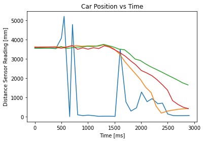
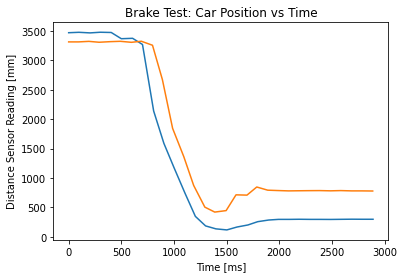

# Lab 4: Characterize Your Car

## Prelab

The prelab required a small amount of soldering to allow the Artemis battery to be plugged in. This became useful for testing later when I used the ToF sensor.

I also wrote some Arduino code to send ToF data over Bluetooth:

```cpp
void get_distance(SFEVL53L1X sensor, String sensorName) {
  sensor.startRanging();
  while (!sensor.checkForDataReady()) {
    delay(10);
  }
  int distance = sensor.getDistance();
  sensor.clearInterrupt();
  sensor.stopRanging();

  currentTime = millis();
  sensorReading = distance;

  tx_estring_value.clear();
  tx_estring_value.append((int)currentTime);
  tx_estring_value.append(":");
  tx_estring_value.append(sensorReading);
  tx_characteristic_string.writeValue(tx_estring_value.c_str());
}
```

This code is then called in the `loop()` of the Lab 2 example Arduino code, where the sensor is initialized in `setup()`. On the Python side, I can collect data in a Jupyter notebook:

```python
# Set up Artemis BLE 
from ble import get_ble_controller
from base_ble import LOG
from cmd_types import CMD
import time
import numpy as np
import matplotlib.pyplot as plt

LOG.propagate = False
ble = get_ble_controller()
ble.connect()

data = []

# Record received string notifications 
def handle_recv_str(uuid, val):
  global data
  data.append(val)

# Collect the data
ble.start_notify(ble.uuid['RX_STRING'], handle_recv_str)
time.sleep(3)
ble.stop_notify(ble.uuid['RX_STRING'])

# Decode and parse
new_data = [n.decode() for n in data]
times = []
distances = []
for d in new_data:
  s = d.split(":")
  times.append(int(s[0]))
  distances.append(int(s[1]))

# Print for good measure, and use this data to plot
print(f"Time (ms): {times}")
print(f"Distance (mm): {distances}")
```

## Test 1: Dimensions
TODO write dimensions


## Test 2: Battery Properties
TODO write batter properties

## Test 3: Speed

I wrote this in a Jupyter notebook:

### Import Requirements

```python
import numpy as np
import matplotlib.pyplot as plt
```

### Speed Tests

#### Procedure
1. Mount the Time of Flight sensor mounted to a bumper (I used tape) and ensure you can get sensor readings from Bluetooth
2. Place the car at one end of the hallway and run data collection to make sure you can see the end of the hall (3000+ mm)
3. While collecting data, run the car as fast as you can towards the other end of the hall while avoiding crashes.

#### Data


```python
speed_tests = [
  {
    "time": [101676, 101774, 101880, 101976, 102073, 102177, 102228, 102333, 102385, 102483, 102579, 102684, 102782, 102879, 102986, 103081, 103187, 103283, 103391, 103485, 103589, 103684, 103789, 103883, 103991, 104078, 104176, 104282, 104380, 104484, 104582],
    "distance": [3579, 3574, 3573, 3578, 3549, 4089, 5215, 11, 4794, 105, 63, 85, 60, 26, 32, 31, 24, 3510, 773, 299, 466, 1285, 786, 944, 681, 711, 149, 63, 61, 62, 68]
  },
  {
    "time": [225453, 225560, 225647, 225753, 225848, 225945, 226051, 226146, 226244, 226340, 226444, 226542, 226648, 226743, 226848, 226941, 227048, 227142, 227239, 227337, 227442, 227535, 227642, 227736, 227834, 227939, 228032, 228138, 228234, 228339],
    "distance": [3633, 3607, 3611, 3628, 3642, 3619, 3633, 3675, 3703, 3662, 3682, 3682, 3670, 3738, 3665, 3529, 3262, 2888, 2570, 2267, 1935, 1547, 1258, 555, 194, 290, 339, 385, 416, 430]
  },
  {
    "time": [318899, 318992, 319096, 319194, 319290, 319395, 319491, 319597, 319691, 319795, 319889, 319995, 320088, 320192, 320289, 320387, 320483, 320587, 320681, 320787, 320882, 320987, 321083, 321190, 321284, 321382, 321479, 321583, 321677, 321783],
    "distance": [3559, 3557, 3566, 3563, 3541, 3653, 3547, 3588, 3622, 3631, 3665, 3651, 3688, 3761, 3691, 3618, 3515, 3483, 3276, 2998, 2928, 2741, 2595, 2454, 2328, 2189, 2056, 1912, 1768, 1654]
  },
  {
    "time": [393221, 393318, 393425, 393520, 393625, 393719, 393826, 393923, 394027, 394125, 394222, 394329, 394424, 394530, 394626, 394731, 394828, 394926, 395022, 395120, 395226, 395319, 395424, 395518, 395622, 395717, 395814, 395918, 396013, 396111],
    "distance": [3608, 3622, 3625, 3626, 3610, 3561, 3615, 3704, 3507, 3582, 3513, 3588, 3541, 3689, 3620, 3469, 3323, 3142, 2912, 2704, 2403, 2289, 2137, 1933, 1663, 1391, 840, 638, 500, 424]
  }
]

for run in speed_tests:
  run["time"] = [x - run["time"][0] for x in run["time"]]
```

#### Plot


```python
for run in speed_tests:
  plt.plot(run["time"], run["distance"])
  plt.title("Car Position vs Time")
  plt.xlabel("Time [ms]")
  plt.ylabel("Distance Sensor Reading [mm]")
```


    

    


### Brake Test

#### Procedure
1. Mount the Time of Flight sensor mounted to a bumper (I used tape) and ensure you can get sensor readings from Bluetooth
2. Place the car at one end of the hallway and run data collection to make sure you can see a distance that is reasonably far (at least 1000 mm)
3. While collecting data, run the car into the wall, but try to stop before you hit it by pressing the button on the remote in reverse of the direction the car is traveling.

#### Data


```python
brake_tests = [
  {
    "time": [527589, 527686, 527792, 527889, 527993, 528089, 528196, 528290, 528396, 528493, 528590, 528694, 528792, 528889, 528987, 529091, 529187, 529291, 529384, 529488, 529581, 529685, 529778, 529882, 529975, 530079, 530172, 530277, 530375, 530479],
    "distance": [3469, 3476, 3466, 3477, 3473, 3367, 3374, 3269, 2139, 1590, 1174, 741, 349, 187, 137, 119, 168, 203, 259, 287, 298, 298, 300, 298, 298, 297, 299, 301, 300, 300]
  },
  {
    "time": [556317, 556411, 556509, 556606, 556711, 556807, 556913, 557007, 557113, 557207, 557304, 557410, 557504, 557610, 557704, 557812, 557906, 558010, 558103, 558207, 558300, 558404, 558497, 558604, 558700, 558804, 558900, 559004, 559100, 559204],
    "distance": [3313, 3313, 3322, 3307, 3317, 3323, 3306, 3324, 3256, 2672, 1844, 1364, 874, 506, 422, 447, 715, 710, 848, 794, 788, 782, 784, 786, 787, 783, 787, 782, 782, 780]
  }
]
# Subtract off the initial time so everything starts at 0 ms
for run in brake_tests:
  run["time"] = [x - run["time"][0] for x in run["time"]]
```

#### Plot


```python
for run in brake_tests:
  plt.plot(run["time"], run["distance"])
  plt.title("Brake Test: Car Position vs Time")
  plt.xlabel("Time [ms]")
  plt.ylabel("Distance Sensor Reading [mm]")
```


    

    


### Conclusions

From the speed tests:
- The car starts at 3600 mm and goes to 430 or 1650 mm in 1500 ms (discounting the blue run for noise), which equates to **1.3 to 2.1 meters per second**. 
- The large range is due to how the car may not have been operating at full speed during all runs, as the battery was at a near-full charge when these runs were executed.
- The measurements may not be perfect due to how the test track has a finite length, and the car drifts right (as seen from the reaas it moves forward. Since 

From the brake tests:
- The car starts at 3310 mm and goes to 300 mm in 1203 ms (blue) or or 780 mm in 1187 ms, which equates to **2.1 to 2.5 meters per second**. 
- The end position for speed is measured at the end of the graph and not the minimum, as **the car would tilt forward (angling the time-of-flight sensor at the floor) in order to stop.** 
- It takes about **750 ms to come to a full stop.** This is counted from the time of minimum distance to the time the readings stabilize.

