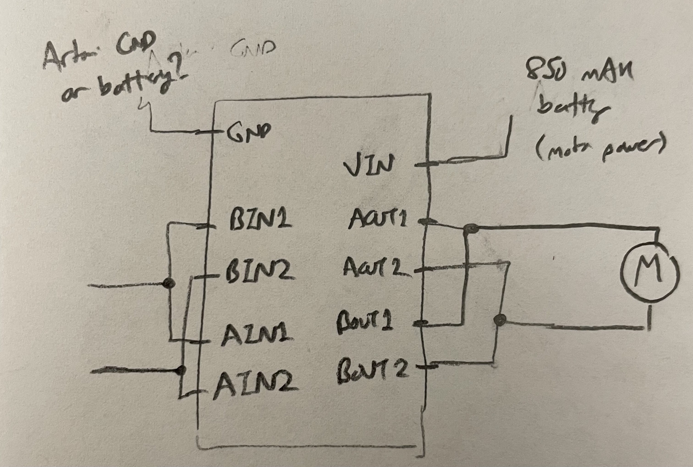
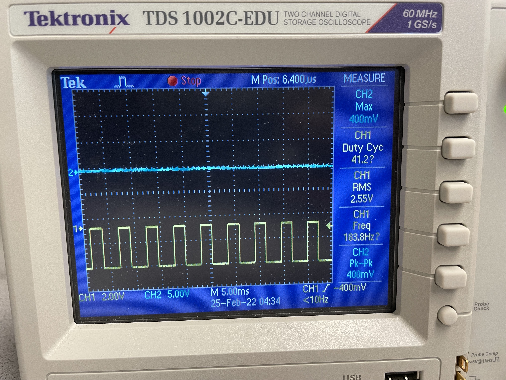
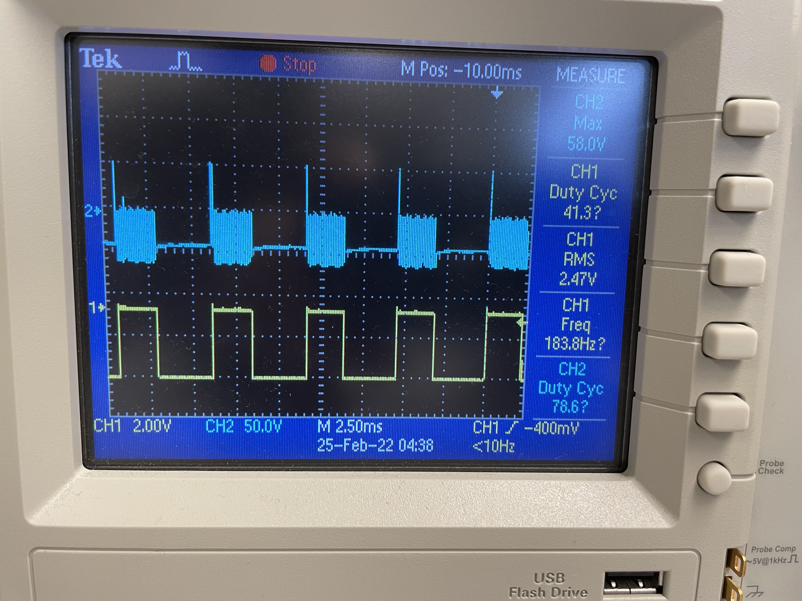

# Lab 5: Motor Drivers & Open-Loop Control

[Click here to return to home page](https://slawrence100.github.io/ece4960-fast-robots/)

## Prelab

Since we need each dual-motor driver to drive a single motor (for added power), I thought of my schematic like this:



This shorts some wires together in order to couple the two spaces for motors together. This way, I can still use only two ports to control each motor.


### Artemis Pin Choice
I chose ports A2, A3, A15, and A16 to control the motors. All of them are PWM-writable, which will allow me to vary the speed of the motors.

### Battery Wiring Choice
I chose to power the Artemis from a separate battery from the motors. Using this second battery helps the Artemis avoid electromagnetic interference from the motors, and also gives me more battery life than using one battery to power both devices.

## Lab 5 Tasks

### Power Supply Test
I used a power supply to test the range of voltages the motor would still turn at. I applied about 2 volts maximum (with a current of about 0.5 A).

[](http://www.youtube.com/watch?v=J-4I9mYcd6c)

### Analog Write Test

I then used an oscilloscope to check out the PWM signals and control I was getting from them.

My first test was to connect the oscilloscope to the Artemis port to see if I could get a good PWM signal to put into the motor driver board. The signal is in yellow, and as expected, I got a square wave. Qualitatively, it also turned slower than when I used a digital write.



My second test was to connect the second oscilloscope probe to the motor while keeping the original probe on the Artemis.



The system seems to respond faster than the PWM, but the motors themselves appeared to rotate continuously.

### Control Code
To get this to work, I used the code below with slight modifications based on what I wanted the car to do (like calling different functions, varying power levels, etc).

The lab code I wrote can also be found on 

I also baked in a few delays to make sure I can let the robot stop, coast, or move out of the way before the robot started moving.

```cpp
#define MOTOR_A_FWD A15
#define MOTOR_A_BACK A16
#define MOTOR_B_BACK A2
#define MOTOR_B_FWD A3

#define MAX_ANALOG 255

#define CALIBRATION_FACTOR 2
#define TURN_FACTOR 2

void setup() {
  pinMode(MOTOR_A_FWD, OUTPUT);
  pinMode(MOTOR_A_BACK, OUTPUT);
  pinMode(MOTOR_B_FWD, OUTPUT);
  pinMode(MOTOR_B_BACK, OUTPUT);
}

void loop() {
  delay(5000);
  test_turns(50); // replace with desired function here
}

void test_turns(int base_power) {

  // Forward
  digitalWrite(MOTOR_A_BACK, LOW);
  analogWrite(MOTOR_A_FWD, base_power);
  digitalWrite(MOTOR_B_BACK, LOW);
  analogWrite(MOTOR_B_FWD, base_power * CALIBRATION_FACTOR);
  delay(500);
  stop();

  // A-turn
  digitalWrite(MOTOR_A_BACK, LOW);
  analogWrite(MOTOR_A_FWD, base_power * TURN_FACTOR);
  digitalWrite(MOTOR_B_BACK, LOW);
  digitalWrite(MOTOR_B_FWD, LOW);
  delay(500 * TURN_FACTOR);
  stop();

  // B-Turn
  digitalWrite(MOTOR_A_BACK, LOW);
  digitalWrite(MOTOR_A_FWD, LOW);
  digitalWrite(MOTOR_B_BACK, LOW);
  analogWrite(MOTOR_B_FWD, base_power * TURN_FACTOR * CALIBRATION_FACTOR);
  delay(500 * TURN_FACTOR);
  stop();

  // Forward
  digitalWrite(MOTOR_A_BACK, LOW);
  analogWrite(MOTOR_A_FWD, base_power);
  digitalWrite(MOTOR_B_BACK, LOW);
  analogWrite(MOTOR_B_FWD, base_power * CALIBRATION_FACTOR);
  delay(500);
  stop();
  
  delay(2000);
}

void go_forward(int base_power){
  digitalWrite(MOTOR_A_BACK, LOW);
  analogWrite(MOTOR_A_FWD, base_power);
  digitalWrite(MOTOR_B_BACK, LOW);
  analogWrite(MOTOR_B_FWD, base_power * CALIBRATION_FACTOR);
  delay(3500);
  analogWrite(MOTOR_A_FWD, 0);
  analogWrite(MOTOR_B_FWD, 0);
}

void test_individual() {
  // A Forward
  digitalWrite(MOTOR_A_BACK, LOW);
  analogWrite(MOTOR_A_FWD, 40);
  delay(1000);
  analogWrite(MOTOR_A_FWD, 0);
  delay(3000);

  // A, Backward
  digitalWrite(MOTOR_A_FWD, LOW);
  analogWrite(MOTOR_A_BACK, 40);
  delay(1000);
  analogWrite(MOTOR_A_BACK, 0);
  delay(3000);

  // B, Forward
  digitalWrite(MOTOR_B_BACK, LOW);
  analogWrite(MOTOR_B_FWD, 40 * CALIBRATION_FACTOR);
  delay(1000);
  analogWrite(MOTOR_B_FWD, 0);
  delay(3000);

  // B, Backward
  digitalWrite(MOTOR_B_FWD, LOW);
  analogWrite(MOTOR_B_BACK, 40 * CALIBRATION_FACTOR);
  delay(1000);
  analogWrite(MOTOR_B_BACK, 0);
  delay(3000);
}

void stop() {
  analogWrite(MOTOR_A_BACK, 0);
  analogWrite(MOTOR_A_FWD, 0);
  analogWrite(MOTOR_B_BACK, 0);
  analogWrite(MOTOR_B_FWD, 0);
  delay(500);
}

```

### Independent Motor Control

I was able to control the motors independently by moving them both a short distance in each direction.

[](http://www.youtube.com/watch?v=okgPsHNcSNE)


### Running the Car
I found out that while running the motors and choosing an appropriate power level to use, there exists a minimum to run the motors at all. I found out the minimum power level to get my car to move is about 40, as a power level of 39 (out of 255 from Arduino's `analogWrite()`, shown in the video) causes the car to beep without movement.

[](http://www.youtube.com/watch?v=Dq2kQNytZB4)

This was done on a nearly-full charge; further tests showed that the limit rises as the car uses its battery more.

### Straight-Line Driving
I found from experimentation that one of my motors was more powerful than the other, so I started off with a calibration factor of 1.2 a priori; that wasn't enough:

[](http://www.youtube.com/watch?v=gtRcaz9DhdA)

After a lot more experimentation (and many crashes into my closet door), I found out the calibration factor is about 2.

[](http://www.youtube.com/watch?v=pRZnPpsYiDo)

To minimize damage from crashes, I set the speed to about 60 - more than the minimum for sure, but not enough to slam into a door full-speed and flip over. My closet door also has some give, so the car would have a chance to slow down instead of flipping over upon hitting a surface like a sturdy wall.

### Open-Loop Control
I wanted to see how turning would work on this robot - it turns out (pun 100% intended) that it takes significantly more power and time to get the robot to turn than I thought. Instead of a 90-degree turn, giving the robot twice as much time and power to turn produced more of an ice-skating swizzle than a true turn.

[](http://www.youtube.com/watch?v=rKg8c19UjPs)


