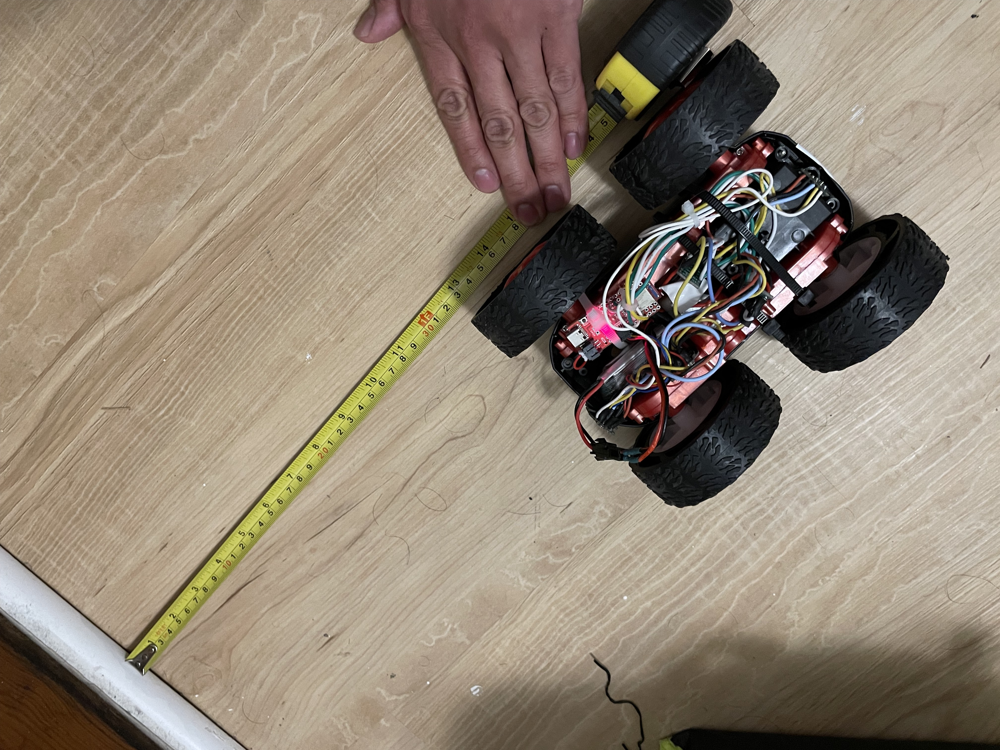

# Lab 6: PID Control

## Prelab
To help debug my system and collect data, I have a mechanism to start and stop data collection. The process looks like this:

1. The bot is turned on and connected to the Python notebook
2. A `RobotControl` instance uses the bluetooth connection to add helpful commands on top of it and allow me to manage the bot in a central way
3. The notebook calls `RobotControl.start_data_collection()`
4. Bluetooth sends the command over to the robot
5. The robot updates a variable that alters its `loop()` to store time of flight values and times in an array.
6. The robot is tasked with doing something with more commands from `RobotControl`. In this lab, that is running PID to not hit a wall.
7. The notebook calls `RobotControl.start_pid()`, which tries to get the robot to get 300mm away from a wall without hitting it. For debugging purposes, it also records the motor input values that come out of the PID controller's computations. These values are stored in an array with fixed length for sending back later.
8. At some point, the Python notebook calls `RobotControl.stop_data_collection()`, which tells the bot to stop storing data and sends back what it has collected all at once. To avoid making too many Bluetooth characteristics to keep track of, I push a sensor reading along with its timestamp to the same characteristic and separate the list out in Python later.

The notebook I used to run this with is similar to the template - my implementation can be found [here](https://github.com/slawrence100/ece4960-fast-robots-code/blob/main/lab06/robot_pid.ipynb)

## Lab Tasks

For this lab, I will do the **Don't Hit The Wall** task. I will use a simple P-controller.

### Data Logged
I logged data for one of my successful runs:

```python
PID: [61.0, 199083.0, 61.0, 199176.0, 60.0, 199280.0, 58.0, 199378.0, 57.0, 199480.0, 54.0, 199589.0, 50.0, 199682.0, 46.0, 199792.0, 42.0, 199884.0, 37.0, 199999.0, 32.0, 200092.0, 26.0, 200207.0, 22.0, 200299.0, 18.0, 200397.0, 14.0, 200504.0, 11.0, 200598.0, 8.0, 200706.0, 6.0, 200803.0, 5.0, 200908.0, 5.0, 201003.0, 5.0, 201108.0, 0.0, 201203.0, 0.0, 201312.0, 0.0, 201408.0, 0.0, 201512.0, 0.0, 201605.0, 0.0, 201710.0, 0.0, 201805.0, 0.0, 0.0, 0.0, 0.0, 0.0, 0.0, 0.0, 0.0, 0.0, 0.0, 0.0, 0.0, 0.0, 0.0, 0.0, 0.0, 0.0, 0.0, 0.0, 0.0, 0.0, 0.0, 0.0, 0.0]
TOF: [441.0, 199083.0, 1523.0, 199176.0, 1522.0, 199280.0, 1524.0, 199378.0, 1510.0, 199480.0, 1479.0, 199589.0, 1440.0, 199682.0, 1380.0, 199792.0, 1318.0, 199884.0, 1236.0, 199999.0, 1148.0, 200092.0, 1042.0, 200207.0, 941.0, 200299.0, 836.0, 200397.0, 746.0, 200504.0, 670.0, 200598.0, 593.0, 200706.0, 531.0, 200803.0, 477.0, 200908.0, 439.0, 201003.0, 414.0, 201108.0, 406.0, 201203.0, 407.0, 201312.0, 406.0, 201408.0, 404.0, 201512.0, 402.0, 201605.0, 405.0, 201710.0, 404.0, 201805.0, 0.0, 0.0, 0.0, 0.0, 0.0, 0.0, 0.0, 0.0, 0.0, 0.0, 0.0, 0.0, 0.0, 0.0, 0.0, 0.0, 0.0, 0.0, 0.0, 0.0, 0.0, 0.0, 0.0, 0.0]
PID_P = 0.05
```

This isn't super readable - the graphs I will show later will explain what this means.

### Test Runs and Documentation
I made four successful test runs. From each of these, **the maximum linear speed I was able to achieve was 1.4 m/s**. Tests in past labs saw a maximum speed of 2 m/s, but that also involved a longer distance than the 2 meters my room is limited to, so the maximum speed may not have been achieved because of a lack of distance to accelerate over.

My code also allows one to specify the P-controller constant. From trial and error, I found that the best constant was 0.05.

All times in the following graphs are in milliseconds, and all distances in the following graphs are in millimeters.

#### Run 1

[](http://www.youtube.com/watch?v=kPEfMuRnGjU)

**Time of Flight Input**


**Control Loop Output**


**End Result: 32 cm**


#### Run 2
[](http://www.youtube.com/watch?v=hRZY0HmItu4)

**Time of Flight Input**


**Control Loop Output**


**End Result: 35 cm**


#### Run 3
[](http://www.youtube.com/watch?v=lt0hfkXV8lY)

**Time of Flight Input**


**Control Loop Output**


**End Result: 40 cm**


#### Run 4
[](http://www.youtube.com/watch?v=a07Wd1iGDKc)

**Time of Flight Input**


**Control Loop Output**


**End Result: 40 cm**


### Frequency
The standard for a control loop is to calculate much faster than the system moves, but I am limited by how fast the sensor can read, which is about 20 Hz. Rather than let the robot move fast and crash more often, I chose to use a smaller proportional constant to compensate for the lack of accurate and frequent sensor data. I also sent all of the sensor and debugging data *after* the entire run was made in order to avoid any processing delays from sending data over Bluetooth.

From the graphs I got from the four successful test runs I did, I chose not to update the range and sampling times outside of their defaults. The graphs all end at about 300 mm, so the car may miss its target of 300 mm because of sensor noise.

### Deadband
With a motor calibration factor of 2 and a deadband around 40, **my motors have a range of values from 40 to 127.** The PID controller might not stay within that range, so I wrote a short function to clip its output to that range of values:

```cpp
#define MIN_POWER 40
#define MAX_POWER 127
#define COAST_POWER 10

int clip_motor_value(float val_in) {
  if (val_in >= MAX_POWER){
    return MAX_POWER;
  } else if (val_in <= MIN_POWER) {
    return 0;
  }
  return round(val_in);
}
```

### Anything Goes
Clipping the motor speed can lead to stopping too early. Since this presents a need for a motor to keep moving at relatively low speeds, my code includes a "hack" statement to *coast* to a stop instead of constantly using a hard brake.

```cpp
if (motor_power >= MIN_POWER) {
  move_backward(clip_motor_value(motor_power));
} else if (motor_power >= COAST_POWER){
  stop_motors(false); // coast if we need some movement but not a lot
} else {
  stop_motors(true); // close enough to equal, so make a hard stop
}
```

Although this makes where my robot will stop a little less predictable than a controlled, slow movement, the limited battery capacity (and variability that causes) makes slow, powered movement more difficult than adding this coasting feature.

### Controller Code
The main loop now includes some code I wrote to collect data as it goes and do P-control if that has been activated.

```cpp
while (central.connected()) {
      write_data();
      read_data();

      if (collect_data) {
        tempMeasurement = get_tof_measurement(distanceSensor, true);
        if (tempMeasurement != -1) {
          current_tof_front = tempMeasurement;
          tof_front_history[tof_front_history_idx] = tempMeasurement;
          tof_front_time_history[tof_front_history_idx] = micros();
          tof_front_history_idx++;
        }

        if (use_pid) {
          // TOF faces backwards, so move backwards too
          motor_power = pid_proportional * (current_tof_front - pid_setpoint);
          pid_motor_power[pid_motor_power_idx] = motor_power;
          pid_motor_power_idx++;
          if (motor_power >= MIN_POWER) {
            move_backward(clip_motor_value(motor_power));
          } else if (motor_power >= COAST_POWER){
            stop_motors(false); // coast if we need some movement but not a lot
          } else {
            stop_motors(true); // close enough to equal, so make a hard stop
          }
        }
      }
    }
```
The full control code (and corresponding notebook) can be found in [my GitHub repository](https://github.com/slawrence100/ece4960-fast-robots-code/tree/main/lab06).

### Other Considerations

#### Integrator Wind-Up
Although I didn't use an integral-based controller, I would likely have to deal with integrator windup had I used it. Integrator wind-up can cause my car to overshoot, which means it could crash into the wall. To avoid it, I would need to clip the output similar to how I did with the motor power.

#### Derivative LPF and Kick
Although I didn't use a derivative-based controller, I would likely have included a low-pass filter had I used one. The derivative controller will amplify any large errors, especially at the beginning (i.e. a derivative kick caused by a change from an initial setpoint to the 300mm specified), so it becomes necessary to limit the influence the derivative has on the final control output. This may also come in handy for when I must change the setpoint when the car does a flip in later labs.

### Range of the P-Controller Constant
To help estimate what the P-controller constant should be, we should consider the range of other factors:
- The distances are all in millimeters
- The motor responds from inputs between 40 and 127
- The car's max speed is about 2000 mm/s, which should correspond to something close to 127 (but doesn't because of the scaling factor - 2 m/s was tested when the car still had its remote and no controls to ensure straight-line driving)
- The farthest the sensor can read is about 4000 mm

So, we can solve for the p-controller constant: 127 = p * 4000.

This gives us a minimum of p = 0.03175. In reality, we'll want something higher because we will likely be closer than 4 meters away from our setpoint.

If we assume we can accept 10 mm of error from our controller, we can solve for the greatest value of our p-controller constant: 40 = p * 10.

This gives us a maximum of 0.25. In reality, we'll want something lower; this number will cause much more aggressive acceleration that's prone to overshooting.

Given both of these estimates, we'll want to choose a constant closer to the minimum to avoid overshooting (at the expense of speed), which is why my choice of 0.05 seems reasonable.
