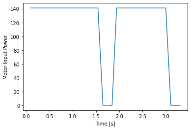

# Lab 7: Kalman Filter

See all the code I wrote on [GitHub](https://github.com/slawrence100/ece4960-fast-robots-code/tree/main/lab07).
## Step Response

To get the step response, I wrote some code that would drive the robot into a wall as fast as it could and stop if the robot get "close enough" to the wall to avoid damaging it. This code appears in my control loop, which looks very similar to how I implemented PID control.

Arduino (in `loop()`):
```cpp
if (use_step_response) {
  // Again, use backwards-facing ToF
  motor_power = clip_motor_value(255);
  if (current_tof_front <= step_stop) {
    motor_power = 0;
    stop_motors(true);
  } else {
    move_forward(motor_power);
  }
  pid_motor_power[pid_motor_power_idx] = motor_power;
  pid_motor_power_idx++;
}
```

Jupyter Notebook:
```python
bot = RobotControl(ble)
bot.stop_notify()
bot.set_motor_calibration(1.8)
bot.start_data_collection()
bot.start_step_response(400)
time.sleep(2.5)
bot.stop_step_response()
bot.stop()
bot.stop_data_collection()
```

The python code allows me to do a few things, like choose how close "close enough" is and change the motor calibration.

### An aside: Programmable Calibration Factor
As I tried this, I ran into issues where my car would no longer drive straight. To avoid having to upload new code repeatedly, I created a command for this as well:

Arduino code (in `handle_command()`):
```cpp
case SET_MOTOR_CALIB:
  success = robot_cmd.get_next_value(new_calib_factor);
  if (!success) return;
  motor_calib_factor = new_calib_factor;
  break;
```

Corresponding Python code (in `RobotControl`):
```python
def set_motor_calibration(self, new_val):
  ble.send_command(CMD.SET_MOTOR_CALIB, new_val)
```

The calibration factor often depended on battery life, so it was helpful to be able to change it this way. This is also important for how the motor power is determined; to avoid driving in a non-straight line, the maximum motor power is clipped based on the calibration factor:

```cpp
motor_power = clip_motor_value(255);
...
int clip_motor_value(float val_in) {
  if (val_in >= (255 / motor_calib_factor) ){
    return int(255 / motor_calib_factor);
  } else if (val_in <= MIN_POWER) {
    return 0;
  }
  return round(val_in);
}
```

### Step Resonse Results




You may notice large spikes in the velocity plot. This is due to the measurement noise of the time of flight sensors, as the velocities are computed by computing the differences of adjacent elements in the time series.

## Kalman Filter Output

See my code for this on [GitHub](https://github.com/slawrence100/ece4960-fast-robots-code/blob/main/lab07/plot_kf.ipynb)

At first, when I used the parameters given in the lecture slides (scaled to meters instead of millimeters), my Kalman filter produced this plot:

```
sampling_rate=7.692307692307692
sigma_1=0.027735009811261455 m, sigma_2=0.027735009811261455 m/s, sigma_4=0.02 m
d=0.374251497005988, m=0.22754950399122473, rise time=1.4 s
Sigma_u:[[0.00076923 0.        ]
 [0.         0.00076923]]
Sigma_z:[[0.0004]]
A: [[ 0.          1.        ]
 [ 0.         -1.64470364]]
B: [[0.        ]
 [4.39464812]]
C: [[-1  0]]
mu_0: [[3.06]
 [0.  ]]
sigma_0: [[0.0363318 0.       ]
 [0.        0.       ]]
```


This plot doesn't do a very good job of estimating where the true state is - I expected it to be closer to the ToF sensor readings, especially near the beginning. It also seems to change more quickly than it should be, which likely means I need to weigh the sensor values more than they presently are.

After tweaking the parameters, I was able to produce a better (but still not great) result:
```
sampling_rate=13.2
sigma_1=0.363318042491699 m, sigma_2=0.0363318042491699 m/s, sigma_4=0.025 m
d=0.374251497005988, m=0.22754950399122473, rise time=1.4 s
Sigma_u:[[0.132   0.     ]
 [0.      0.00132]]
Sigma_z:[[0.0004]]
A: [[ 0.          1.        ]
 [ 0.         -1.64470364]]
B: [[0.        ]
 [4.39464812]]
C: [[-1  0]]
mu_0: [[3.06]
 [0.  ]]
sigma_0: [[0.36331804 0.        ]
 [0.         0.        ]]
```


Each value in a covariance matrix (sigma) determines how much we trust either the model or the sensor, so we can use this to get some ballpark values:
- The top left element of `Sigma_u` is the process noise in the position. I trust the sensor value to 0.3 meters.
- The bottom right element of `Sigma_u` is the process noise in the velocity. I expect the model to do a much better job at predicting velocity, so I set it to something much smaller (about 0.04 m/s).
- I know my sensor is noisy, so I set the measurment noise to 0.025 m (or 25 mm)
- The rest of the computations follow from lecture.

This new plot is more consistent with my observed results - when trying this, the car drove in a mostly-straight line towards the wall, crashed (causing it to turn to a wall around a corner to approach it at an angle), and crashed into that wall as well. The new plot oscillates in the beginning though; I didn't observe this, but I suspsect the oscillations come from the noisy sensor readings and how the car needed to overcome static friction in the beginning.

### Kalman Filter Code

Most of the code is the same from lecture and lab handouts, but I made one minor change - in the given `kf()` code, I had to change the dimention of the identiy matrix because my state space is 2 by 1 (and not 3 by 1)

```python
sampling_rate = len(tof_times) / 2.5
sigma_1 = np.sqrt(0.1**2 * sampling_rate) # Trust in modeled position
sigma_2 = np.sqrt(0.01**2 * sampling_rate) # Trust in modeled speed
sigma_4 = 0.025 # measurement noise
sig_u=np.array([[sigma_1**2,0],[0,sigma_2**2]]) # u = dist from wall
sig_z=np.array([[sigma_4**2]]) # measurement noise

d = 1 / abs(steady_state_vel)
m = -d * rise_time / np.log(0.1)

A = np.array([[0,1], [0, -1*d/m]])
B = np.array([[0], [1/m]])
C = np.array([[-1,0]])

x = np.array([[tof_vals[1]],[0]])
delta_t = 1 / sampling_rate
A_d = np.eye(2) + delta_t * A
B_d = delta_t * B

def kf(mu_prev,sigma_prev,u,y):
    
    mu_p = A.dot(mu_prev) + B.dot(u) 
    sigma_p = A.dot(sigma_prev.dot(A.transpose())) + sig_u
    
    y_m = y-C.dot(mu_p)
    sigma_m = C.dot(sigma_p.dot(C.transpose())) + sig_z
    kkf_gain = sigma_p.dot(C.transpose().dot(np.linalg.inv(sigma_m)))

    mu = mu_p + kkf_gain.dot(y_m)    
    sigma=(np.eye(2)-kkf_gain.dot(C)).dot(sigma_p)

    return mu,sigma
```

After fixing an error with my code (I incorrectly scaled my motor input), I got this graph:
```
sampling_rate=13.2
sigma_1=0.363318042491699 m, sigma_2=0.0363318042491699 m/s, sigma_4=0.025 m
d=0.374251497005988, m=0.22754950399122473, rise time=1.4 s
Sigma_u:[[0.132   0.     ]
 [0.      0.00132]]
Sigma_z:[[0.000625]]
A: [[ 0.          1.        ]
 [ 0.         -1.64470364]]
B: [[0.        ]
 [4.39464812]]
C: [[-1  0]]
delta_t: 0.07575757575757576
A_d: [[1.         0.07575758]
 [0.         0.87540124]]
B_d: [[0.        ]
 [0.33292789]]
 mu_0: [[3.06]
 [0.  ]]
sigma_0: [[0.36331804 0.        ]
 [0.         0.        ]]
```


Although it looks like the Kalman Filter did little to the the position readings, the velocity plot seems much more reasonable with the Kalman filter than without. Both still have regions of relatively large errors, but the Kalman Filter's velocities that occur near 0 are far more reasonable and frequent than the ones from the ToF data alone.

