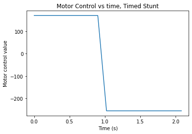
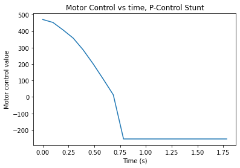

# Lab 8: Stunts (Redone)

## Objective
Re-do the stunts shown in [the original Lab 8](https://slawrence100.github.io/ece4960-fast-robots/lab8)

### What went wrong before?
- The original Lab 8 stunt didn't clear the white line, which means I needed to find a way to either get my timings tighter or use the sensors better.
- There was no open-loop stunt in my original Lab 8 page.
- The code was cluttered and difficult to make improvements upon.

## Controlled Stunts: Take 2
The codebase I developed in labs 12 and onward felt much cleaner than my original implementation, so I used that instead of my original lab 8 code. It features a few new additions, such as the ability to drive for certain distances based on P-control and a ToF, as well as the ability to record data while driving forward in a simpler way.

### Moving forward with P-control
Lab 12 taught me a better way to organize my code for P-controlled movement. Instead of making a messy main loop, I put all my PID code into a blocking function. It also pings the bluetooth device occasionally in order to avoid disconnecting; although that may have some small impacts on sensor reading frequency, it was better than having a robot only complete part of the maneuver before disconnecting.

```cpp
void move_distance(int dist) {
  int tof_dist = get_tof_measurement(distanceSensorTwo, 5); // average of 5 tries
  int target = tof_dist - dist;
  int motor_power;
  int coast_power = 20;

  while (true) {
    tof_dist = get_tof_measurement(distanceSensorTwo, 1);
    motor_power = pid_proportional_fwd * (tof_dist - target);
    if (motor_power < -1*pid_min_power_fwd) {
      move_backward(motor_power);
    } else if (motor_power > -1*pid_min_power_fwd && motor_power < -1*coast_power) {
      stop_motors(false);
    } else if (motor_power > -1*coast_power && motor_power < coast_power) {
      stop_motors(true);
      return;
    } else if (motor_power > coast_power && motor_power < pid_min_power_fwd) {
      stop_motors(false);
    } else if (motor_power > pid_min_power_fwd) {
      move_forward(motor_power);
    }
  }
}
}
```

### Time-Based Stunt
I had some initial difficulty with using P-control, but that largely came from inconsistencies in the robot's power transmission itself; the robot would sometimes "stutter" and move forward a small amount and slow down before coming up to a normal speed. There were also times I had to re-tune the P-controller, leading to two implementations of stunt code.

My first implementation looked a lot like my old one in Lab 8, which was largely open-loop. I made an improvement by sending all stunt commands at once; that way, potential inconsistency with bluetooth latency would not affect the motion of the robot.

```cpp
case DO_TIMED_STUNT:
    ...
    // Move forward
    move_forward_and_record(temp_move, temp_time);
    
    Serial.println("Stop");
    // Stop midway if asked
    ...
    if (temp_move == 1) {
      Serial.println("Sent stop");
      stop_motors(true);
      delay(100);
    }

    // move backwards
    ...
    move_backward_and_record(temp_move, temp_time);
    
    stop_motors(true);
    break;
```

(some ellipses appear here for brevity, they contain code that gets any temporary variables)

Of course, this led me to have to devise a way to record PID information in a smarter way too. Instead of doing everything in the main Arduino loop, I used a loop and counter to avoid having to `delay()`:

```cpp
void move_forward_and_record(int base_power, int duration) {
  unsigned long target = millis() + duration;
  bool done = false;
  int meas;
  
  move_forward(base_power);
  while (!done) {
    meas = get_tof_measurement(distanceSensorTwo, true);
    record_data(meas, base_power);
    done = (millis() > target);
  }
}
```

The results came out well; my robot could now cross the line more clearly.

[](http://www.youtube.com/watch?v=2f7QRdYa53U)




### Sensor-Based Stunt
Now that I had gotten a better time-based stunt, I wanted to see if P-control could help me more. This caused me to write code for a sensor-based flip:

```cpp
case DO_STUNT:
    ... // get temp vars from args
    drive_until(temp_move);
    move_backward_and_record(255, 1000);
    stop_motors(true);
    break;
```

The way I `drive_until()` looks much like driving forward a certain distance.

```cpp
void drive_until(int tof_target) {
  int tof_dist = get_tof_measurement(distanceSensorTwo, 5);
  ...
  while (true) {
    tof_dist = get_tof_measurement(distanceSensorTwo, 1);
    motor_power = pid_proportional_fwd * (tof_dist - tof_target);
    record_data(tof_dist, motor_power);
    if (motor_power < -1*pid_min_power_fwd) {
      move_backward(motor_power);
    } else if (motor_power > -1*pid_min_power_fwd && motor_power < -1*coast_power) {
      stop_motors(false);
    } else if (motor_power > -1*coast_power && motor_power < coast_power) {
      stop_motors(true);
      return;
    } else if (motor_power > coast_power && motor_power < pid_min_power_fwd) {
      stop_motors(false);
    } else if (motor_power > pid_min_power_fwd) {
      move_forward(motor_power);
    }
  }
}
```

The results came out much better than my previous trials where I essentially abandoned my sensor in the original lab 8 page.

[](http://www.youtube.com/watch?v=WUa14akPy8o)




The large spike in the ToF graph comes from the noise from flipping and trying to see a distance that's too far for the sensor to reach, as well as my hand moving in to grab the robot off the floor after the flip is over.

## Open-Loop Stunts

I originally planned to try to get my robot to parallel park. After trying a few times and seeing some reliability issues with getting into a specific spot, I tried to increase reliability by removing the tape attached to the wheels that I used before when trying to get the robot to spin on its axis easier. That left a sticky residue on my wheels.

However, the glue remover I needed to remove the adhesive from the wheels had the unintended side effect of making the table and wheels slippery! That led to my open-loop stunt: The Parking Drift!

[](http://www.youtube.com/watch?v=XlI2pmH9c3A)

The controls I used for this are listed below:
```python
bot.move_duration(100,500) # 100 power, 500 ms
bot.spin(80,-80,900) # 80 L, -80 R, 900 ms
bot.move_duration(100,1800)
bot.spin(100,80,500)
```

This also took a few tries to perfect, which brought rise to this bloopers video:

[](http://www.youtube.com/watch?v=nqheZMJb8gQ)