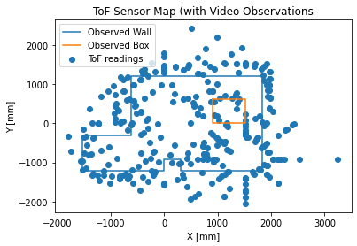
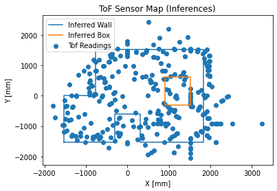
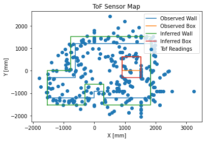

# Lab 9: Mapping (real)

[Click here to return to home page](https://slawrence100.github.io/ece4960-fast-robots/)

## Objective
Map a set-up series of walls and obstacles from multiple points in the lab.

## Prelab
To make the map, I wanted to use my robot to spin in precise intervals and take sensor data to create a point cloud, much like how a radar creates one by knowing a series of angles and distances.

My plan was to do this:
1. Set up a PID controller to spin the robot 20 degrees, using the gyroscope
to determine the angle
2. Read a ToF distance
3. Record the ToF distance and angle in an array on the robot
4. Repeat steps 1 through 3 until 1 revolution has been made
5. Send all the data back to a Jupyter notebook
6. Combine all the data into a map

But of course, this didn't run smoothly...

### Problems

**Trying to get the robot to spin on its axis was difficult.e**. I had known this would happen, so I used my existing motor calibration command to change it on the Python side and send it to the robot. Experimentation revealed that the calibration value would range from 1.2 to 1.8 and change about once a day. Although this was an improvement, I also added tape to the wheels to allow them to slip easier.

**PID control spun uncontrollably sometimes.** To solve this, I realized that I made a sign error; if the signs are incorrect, the robot worsens its error instead of improves it because it spins in the opposite direction it needs to.

**The robot's gyroscope isn't always an accurate way to determine heading.** Although the robot would spin roughly the same amount per measurement, it would not always spin 20 degrees per measurement. To solve this, I added a parameter to change the time difference the robot uses to integrate gyrosocope angular velocity into position. This required some tuning, and this made some major improvements, but I also counted the number of motions needed to make a full revolution to clean up the data further.

## The Maps

TODO describe what these maps mean and why they look the way they do